# Contents

[Matte Black](#matte-black)

[Project Goals](#project-goals)

[UX](#ux)
+ [User Stories and Agile](#user-stories-and-agile)
+ [Agile](#agile)
+ [Colors](#colors)
+ [Fonts](#fonts)
+ [Structure](#structure)
+ [Wireframes](#wireframes)
    + [Home Page](#home-page)
    + [Sign-Up Page](#sign-up-page)
    + [Sign-In Page](#sign-in-page)
    + [User Logged-in Posts](#user-logged-in-posts)
    + [Add Posts](#add-posts)
    + [Profile Pages](#profile-pages)
    + [Contact Us](#contact-us)
    + [No Results Pages](#no-results-pages)
    + [Mobile Template](#mobile-template)
+ [Existing Features](#existing-features)
    + [Navbar Features](#navbar=features)
    + [Sign Up Features](#sign-up-features)
    + [Sign In Features](#sign-in-features)
    + [Sign Out Features](#sign-out-features)
    + [Post Features](#post-features)
    + [Add/Edit/Delete Post Features](#add-edit-delete-post-features)
    + [Profile Page Features](#profile-page-features)
    + [Edit My Profile Features](#edit-my-profile-features)
    + [Comment Features](#comment-features)
    + [Contact Us Features](#contact-us-features)
    + [Icon Features](#icon-features)
    + [Button Features](#button-features)
    + [Follow/Unfollow Features](#follow-unfollow-features)
    + [Button Features](#button-features)
    + [Loading Features](#loading-features)
    + [Not Found Features](#not-found-features)
    + [Search Features](#search-features)
    + [Placeholder Features](#placeholder-features)
    + [Mobile Features](#mobile-features)
    + [Favicon Features](#favicon-features)
+ [Future Features](#future-features)

[Technologies Used](#technologies-used)
+ [Technologies and Programs Used](#technologies-and-programs-used)

[Testing](#testing)
+ [Functionality and Compatibility Testing](#functionality-and-compatibility-testing)
+ [Code Validator Testing](#code-validator-testing)
+ [SEO Testing](#seo-testing)
+ [Manual Testing](#manual-testing)

[Bugs](#bugs)
+ [Fixed Bugs](#fixed-bugs)
+ [Unfixed Bugs](#unfixed-bugs)

[Deployment](#deployment)

[References](#references)

[Acknowledgements](#acknowledgements)

# Matte Black

[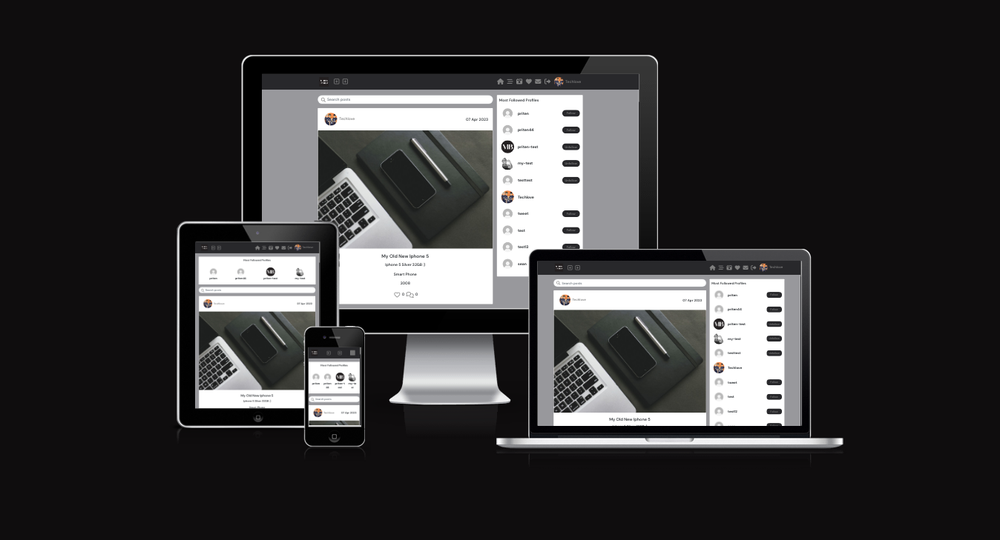](https://matte-black.herokuapp.com/)

Live Site: [Click Here](https://matte-black.herokuapp.com/)
Github Frontend: [Click Here](https://github.com/PritenMakwana44/matte-black)
Github Backend: [Click Here](https://github.com/PritenMakwana44/mb-api)

# Project Goals
The purpose of this website was to give tech lovers a place to share posts about their tech and aesthetic looking pictures of their tech setups.
Along with this the agenda was to build a community where like minded tech enthusiats can come togther to discuss and share their favourite tech.

The application was built on HTML, CSS, Javascript, React.js, Bootstrap and Django REST Framework.

## UX

### User Stories and Agile

Notion was used to manage User stories and bugs.
I decided to structure my user stories slightly diffrent as it worked best for me in the following way. I constructed project goals and mapped a single user story per project goal. I also decided to use Notion as I felt it would allow me to have a better level of flexability.

I split it into the following sections: Planning, In progress,cancelled, done, future features and bugs.

I was able to successfully manage my project using Agile without any issues.

Can find my Notion Project management here: [Cick Here](https://time-periodical-439.notion.site/2c93fe949a724558bce2a02392ce1c2e?v=fa2256167a4943d1b93b84758142e771).

[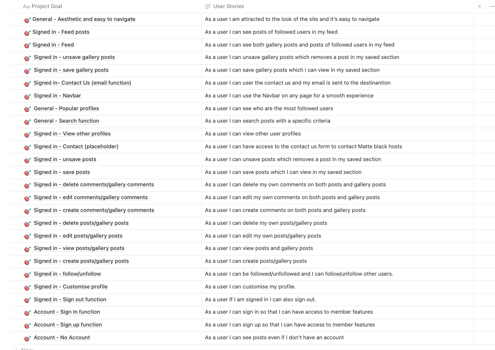](https://time-periodical-439.notion.site/2c93fe949a724558bce2a02392ce1c2e?v=fa2256167a4943d1b93b84758142e771)

### Colors
- Matte Black: #28282B
- Default Grey : Grey
- Default: Orange

### Fonts
- Main Font: Noto Sans TC 
- Secondary Font: sans-serif

### Structure

The goal of the site structure is to be basic, clean and simple. The structure should be easy to navigate.

Site Structure:

    1. Home page which includes list of posts
    2. Sign up page
    3. Sign in page
    4. Add post or gallery post form pages
    5. Feed page to only show posts for users your following only
    6. Gallery post page
    7. Saved posts page
    8. Gallery post/post page(when you click on a post or gallery post)
    9. Contact page
    10. Profile page
    Nav bar is shown on all pages.

## Wireframes 

I used Balsamiq to create my wireframes. I based my designs on a desktop site first then made them responsive after built. I did create just 1 mobile template to base the responsiveness.

### Home Page
This is my Wireframe for my home page when not signed in.

### Sign-Up Page
This is my Wireframe for my Sign-up page.

### Sign-In Page
This is my Wireframe for my Sign-in page.

### User Logged-in Posts
This is my Wireframe template for all post streams such as galleryposts, posts, saved and feed for a logged in user.

### Add Posts
This is my Wireframe for my add posts and gallery posts.

### Profile Pages
This is my Wireframe for profiles which include my own profile and other users profiles.

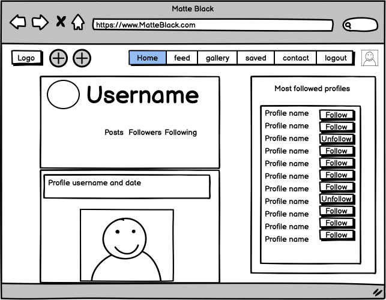

### Contact Us
This is my Wireframe for my contact us form.

### No Results Pages
This is my Wireframe for my no results pages.

### Mobile Template
This is my Wireframe for mobile resposiveness. This is merley a template of what the navbar, and most followed profiles look in mobile form.

## Existing Features

### Navbar Features
For anyone who comes into the site this is the default navbar throughout the website. More icons appear in the Navbar when the user is logged in. As the third picture shows it is fully responsive on mobile.
### Related User Stories:
- As a user I am attracted to the look of the site and it’s easy to navigate
- As a user I can use the Navbar on any page for a smooth experience

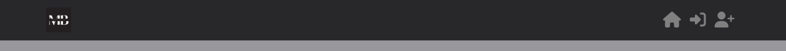

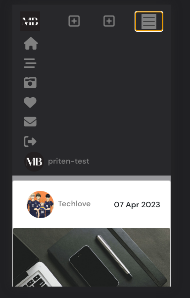

### Sign Up Features
If a user clicks sign up this is the form it brings the user to so they can get access to more features by becoming a member.
### Related User Stories:
- As a user I can sign up so that I can have access to member features

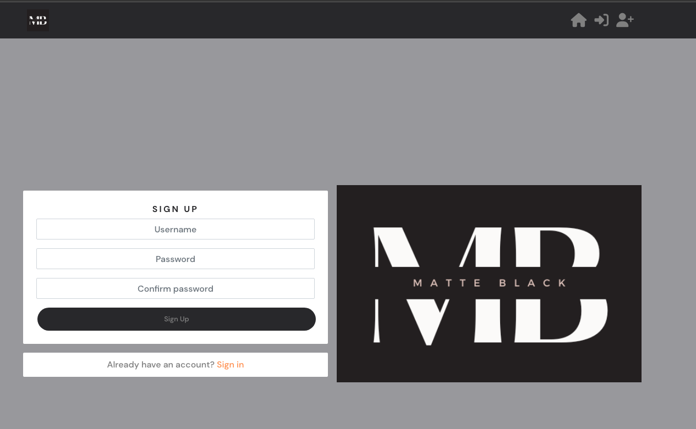

### Sign In Features
If a user clicks sign in this is the form it brings the user to so they can get access to more features by signing in.
### Related User Stories:
- As a user I can sign in so that I can have access to member features

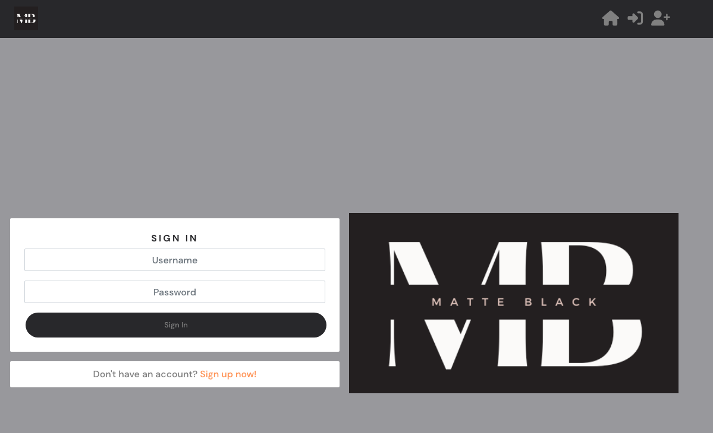

### Sign Out Features
On the navbar there is a signout icon which allows the logged in user to sign out at any time.
### Related User Stories:
- As a user If I am signed in I can also sign out

### Post Features
There are a few diffrent places where posts can be seen. There is the home page which shows posts, there is the feed which only shows posts for followed users, there is gallery posts, there are also a saved posts section and there are posts on each users profile page. All feeds have infinite scroll. Only posts on the home page can be seen by users who aren't logged in.
### Related User Stories:
- As a user I can see posts of followed users in my feed
- As a user I can view posts and gallery posts

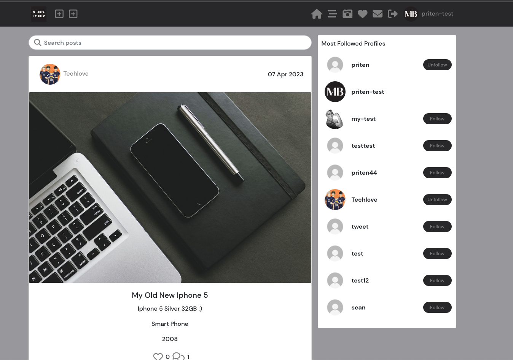
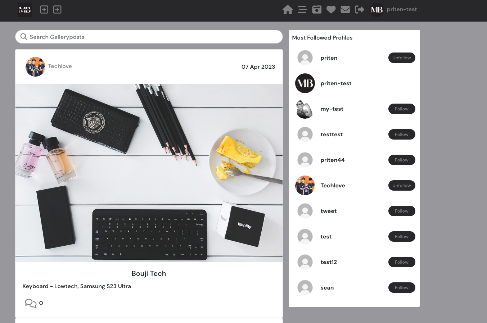
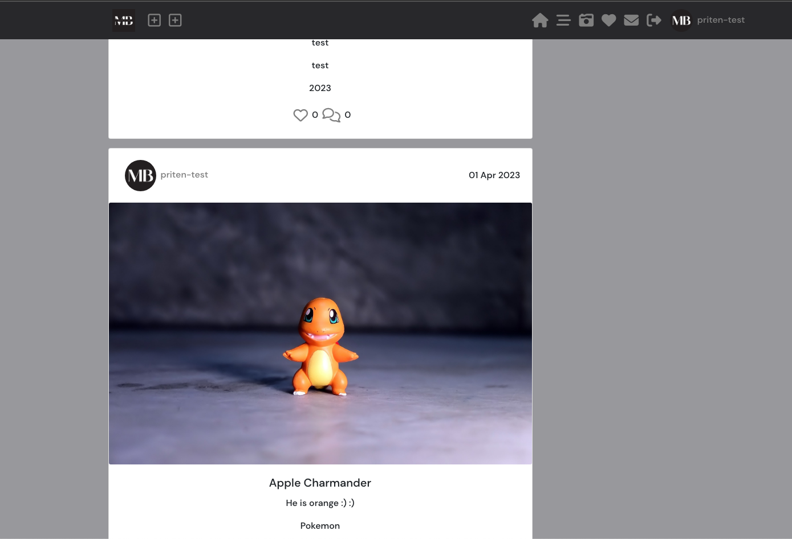

### Add/Edit/Delete Post Features
Signed in users can add posts or gallery posts via the navbar on the top left which leads to a form.
If a signed in user clicks on a post they have created they will see right dots on the right of the post.
They can then either edit or delete the post. Hence the posts are CRUD verified.
### Related User Stories:
- As a user I can create posts/gallery posts
- As a user I can view posts and gallery posts
- As a user I can edit my own posts/gallery posts
- As a user I can delete my own posts/gallery posts

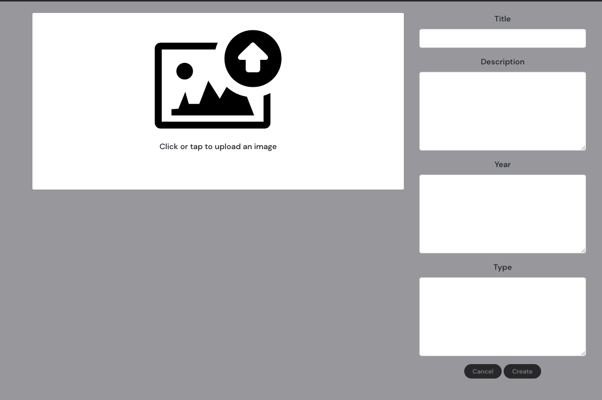
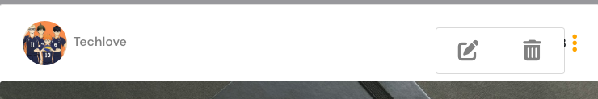

### Profile Page Features
Each user has a profile page if they are signed up. You will also have your own profile page for your own account. This shows your posts only.It also shows how many posts, followers and following you have.
### Related User Stories:
- As a user I can view other user profiles

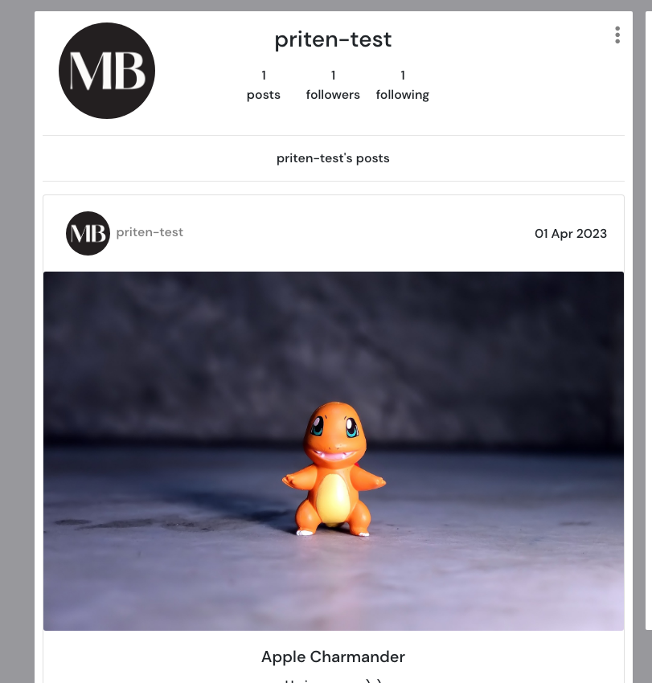

### Edit Profile Page Features
Each user has a profile page if they are signed up. There is functionality to be able to change your username, password and edit your profile.
By editing your profile you can create a tech bio on your profile and change your profile image.
### Related User Stories:
- As a user I can customise my profile

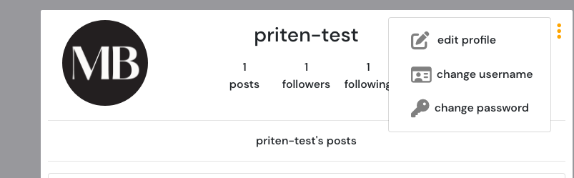

### Comment Features
All users can see all comments on every post. All logged in users can comment on any post including their own.
A user can create,read,update and delete their own comments.

### Related User Stories:
- As a user I can create comments on both posts and gallery posts
- As a user I can edit my own comments on both posts and gallery posts
- As a user I can delete my own comments on both posts and gallery posts

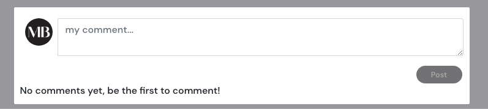

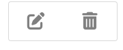
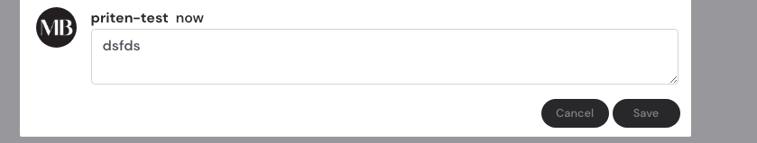

### Contact Us Features
If your a logged in user, you will also have access to the contact us page. The form is working however it doesn't actually send an email to Matte Black yet. So that will be in the future features to fix.

### Related User Stories:
- As a user I can have access to the contact us form to contact Matte black hosts

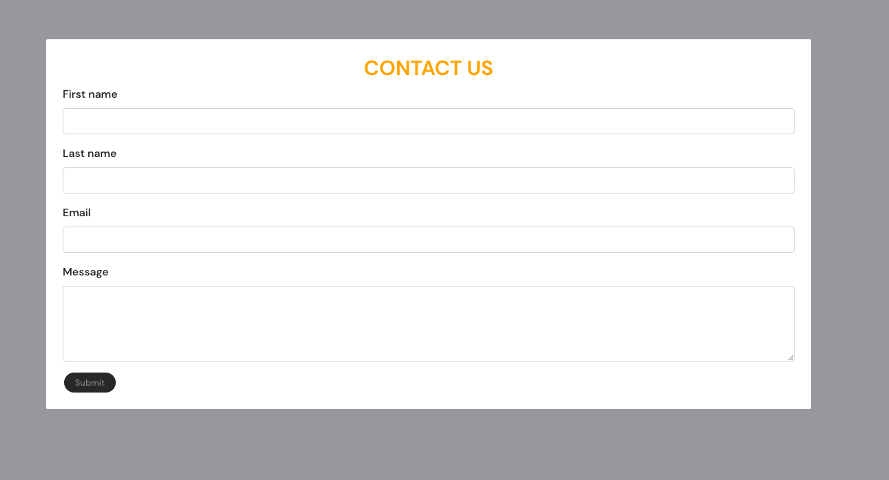
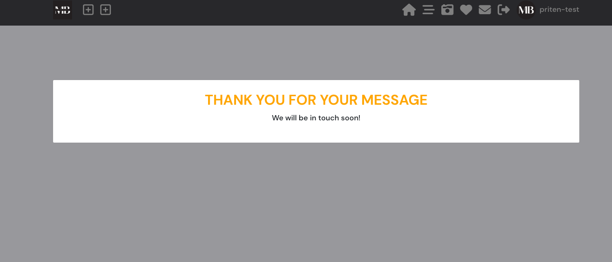

### Icon Features
Various icons are used for a pleasing looking site. Such as the navbar icons with a hover feature for text. Also the comment and saves icon which is also great! If a user clicks the saves button the number increases and the post shows in their saved section. If it's clicked again then it moves it back out and unsaves the post. 
The comments is similar as shown previously in this section.

### Related User Stories:
- As a user I am attracted to the look of the site and it’s easy to navigate
- As a user I can save posts which I can view in my saved section
- As a user I can unsave posts which removes a post in my saved section

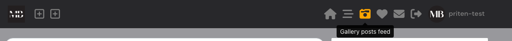
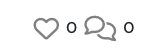

### Button Features
The button's are black and as you hover over them they turn orange. If you click them they will interact back. For example if you click the follow button it turns back to black and has a blue outline then the text changes to unfollow. 

### Related User Stories:
- As a user I am attracted to the look of the site and it’s easy to navigate

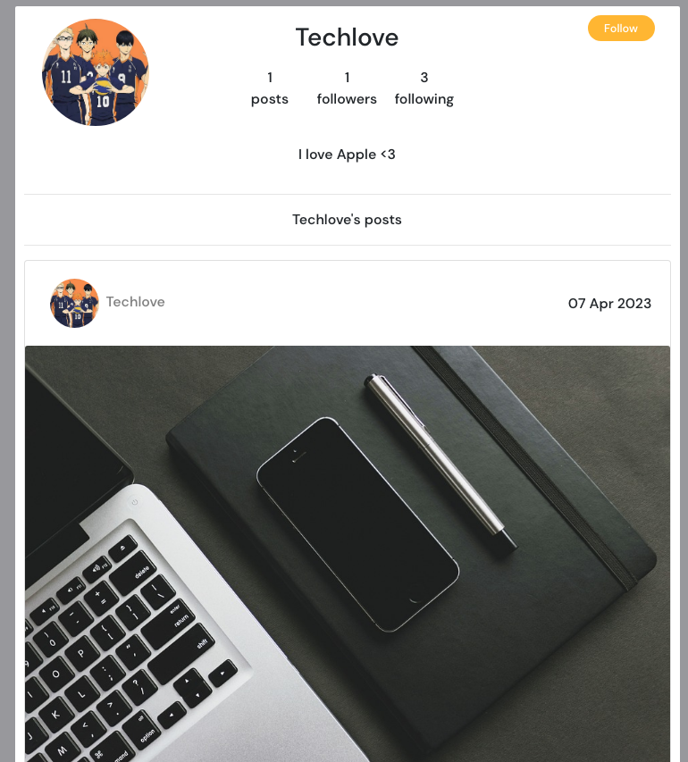
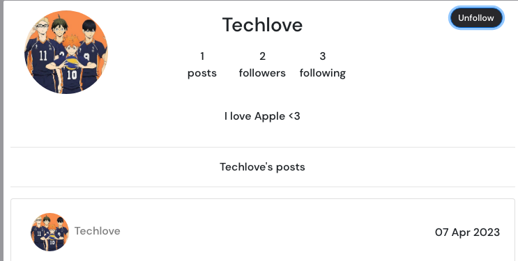

### Follow/Unfollow Features
The follow and unfollow features work by if you follow a user then in your feed you will see their posts, when they post. If you reach a high volume of followers you might then make to the bar on the right which appears in most pages which is the most followed profiles section. 

### Related User Stories:
- As a user I can be followed/unfollowed and I can follow/unfollow other users
- As a user I can see who are the most followed users

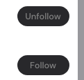
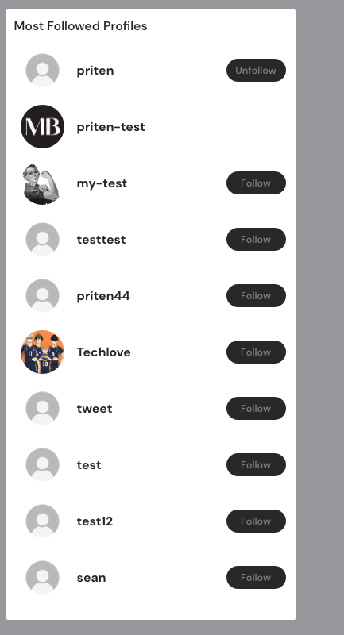

### Loading Features
The loading animation is used on every page. This allows the user to actively see the page is doing something in the background to load for them. It's a nice feature to make the pages seem a lot smoother to navigate.

### Related User Stories:
- As a user I am attracted to the look of the site and it’s easy to navigate

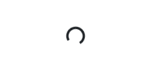

### Not found Features
The not found feature is great feedback for the user to know the site isn't broken, but there just wasn't anything to show. This can either be in the saved section if you haven't saved anything, or even on other user profiles if they haven't posted anything. May also occur if you try search for a post which doesn't exist by the keyword.

### Related User Stories:
- As a user I am attracted to the look of the site and it’s easy to navigate

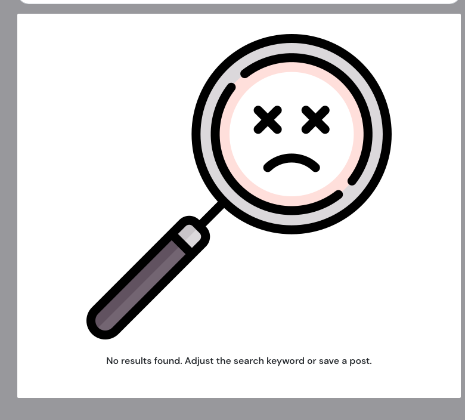

### Search Features
The Search feature is shown on most pages. This allows the user to type in a word and see if they can find the post they are looking for rather then scrolling for a long time to find the post. 

### Related User Stories:
- As a user I am attracted to the look of the site and it’s easy to navigate
- As a user I can search posts with a specific criteria

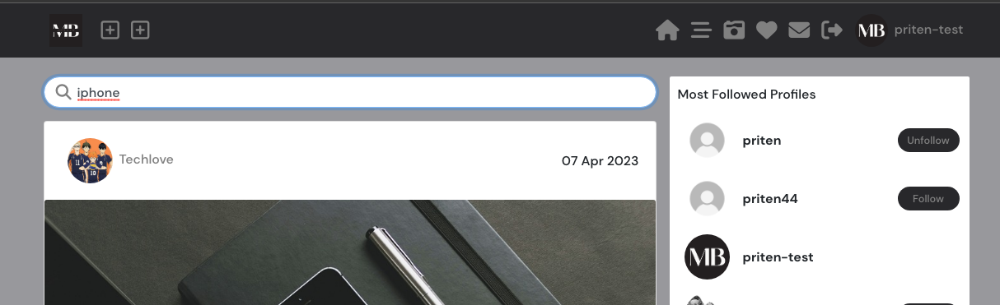

### Placeholder Features
The placeholder image is a nice touch which makes sure even if a user doesn't have an image to upload they can still post. Just makes it a bit more visually appealing. The placeholder is used for post images and for profile images.

### Related User Stories:
- As a user I am attracted to the look of the site and it’s easy to navigate

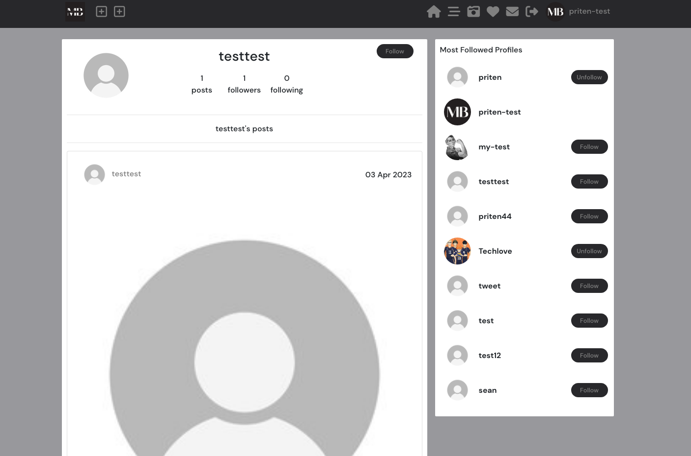

### Mobile Features
The Mobile responsiveness makes my site usable on any device from desktop, to tablet to mobile.

### Related User Stories:
- As a user I am attracted to the look of the site and it’s easy to navigate

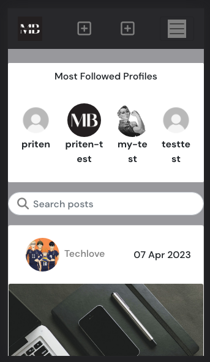

### Favicon Features
The favicon is just a nice touch to make the website my very own! Every detail matters.

### Related User Stories:
- As a user I am attracted to the look of the site and it’s easy to navigate

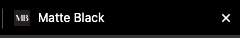

## Future Features
    1. Be able to save/unsave gallery posts in conjunction with saved section.
    2. Have the contact us function working.
    3. When following users currently only posts show in the feed, extended functionality to add gallery post.
    4. On the profile page only posts show. Again extending functionality for gallery posts. 
    5. Speed up site performance.

# Technologies Used
### Technologies and Programs Used:
+ GitHub
    + Used for version control
    + Hosted platform for website
+ Notion
    + Project management Agile tool
+ Heroku 
    + App deployment
+ ElephantSQL
    + Used as the database for project
+ Cloudinary
    + Used for static media storage
+ Balsamiq:
    + Create wireframes
+ Bootstrap:
    + Style webiste
+ Font Awesome:
    + Used for Icons
+ Google Fonts
    + Used for Fonts
+ Languages used
    + HTML5
    + CSS3
    + Javascript
    + React.js
    + Python
    + Django Rest Framework
+ Gitpod - IDE
+ Google - Research platform.
+ LucidChart - Create diagram
+ Favicon.io - Create favicon

    

# Testing

## Functionality and Compatibility Testing
For functionality testing I tested my website in all diffrent sizes in chrome, firefox and safari.
My project looked great on all browsers and were responsive on mobile, tablet and desktop. There was room for improvement but the responsiveness was still functional.
Much testing was done using an Iphone 13 pro, iPad pro and Macbook Pro 13". This ensured I knew what impact my changes were continously making. 

## Code Validator Testing

## HTML:

I used the following Html validator to validate my project. I validated all template pages such as home, posts, profiles,contact and signup forms. 
It was validated via: https://validator.w3.org/
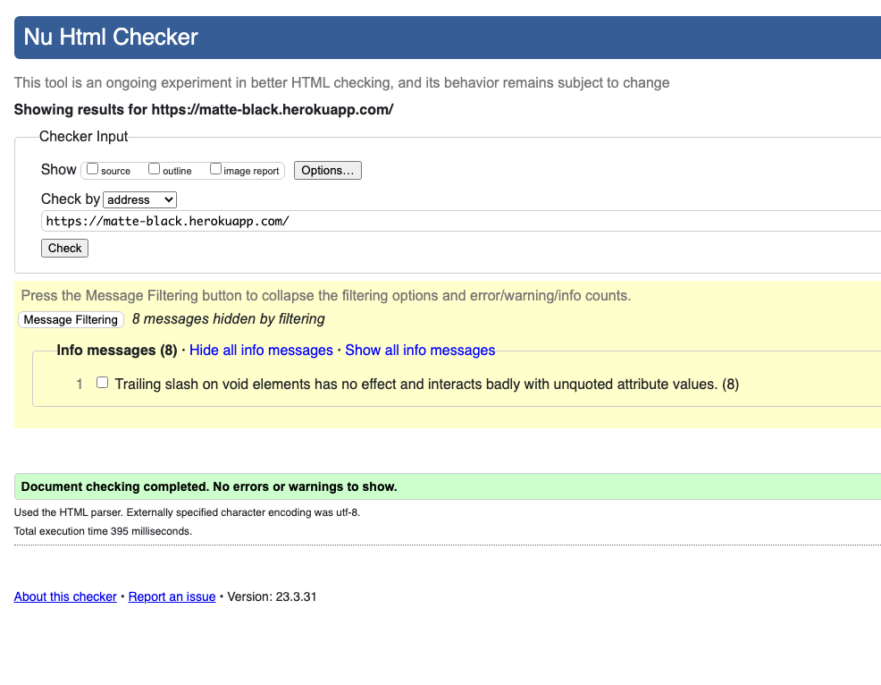
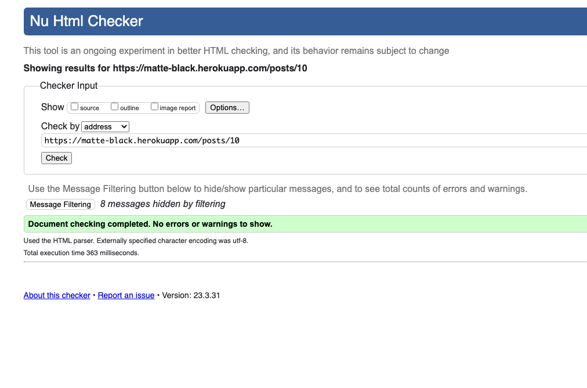

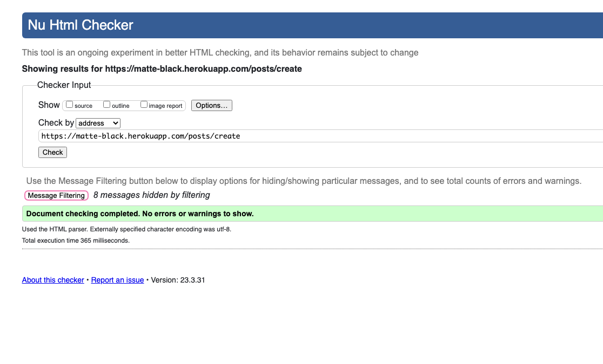
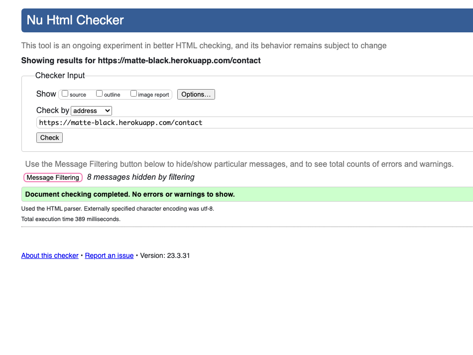
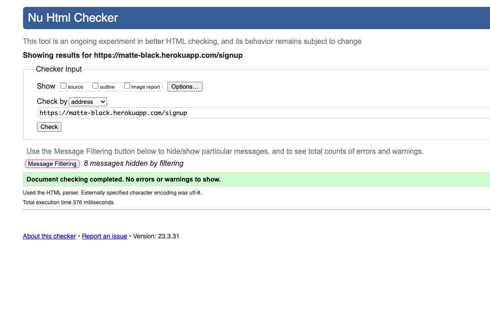

## CSS:

I used the following css validator to validate my project. I validated all template pages such as home, posts, profiles,contact and signup forms.  

It was validated via: https://jigsaw.w3.org/css-validator/

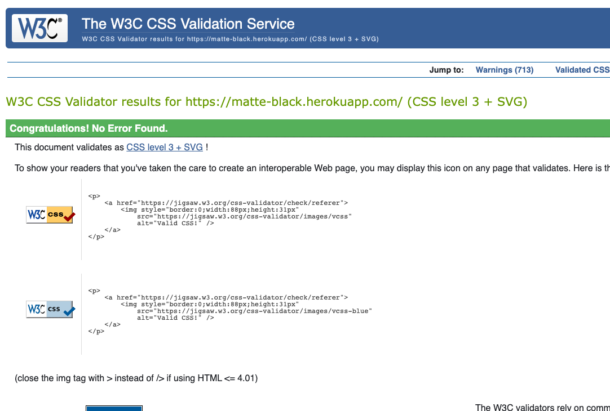
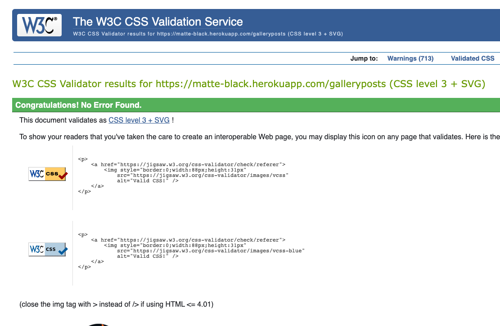
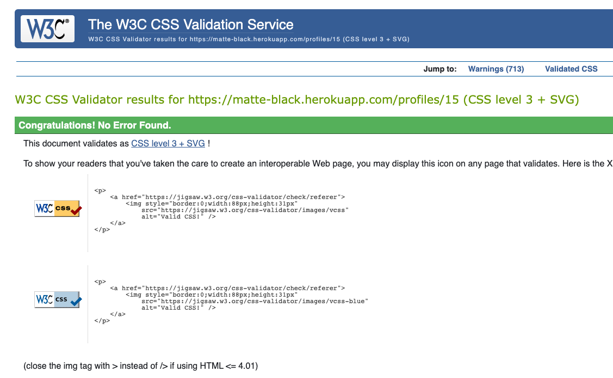
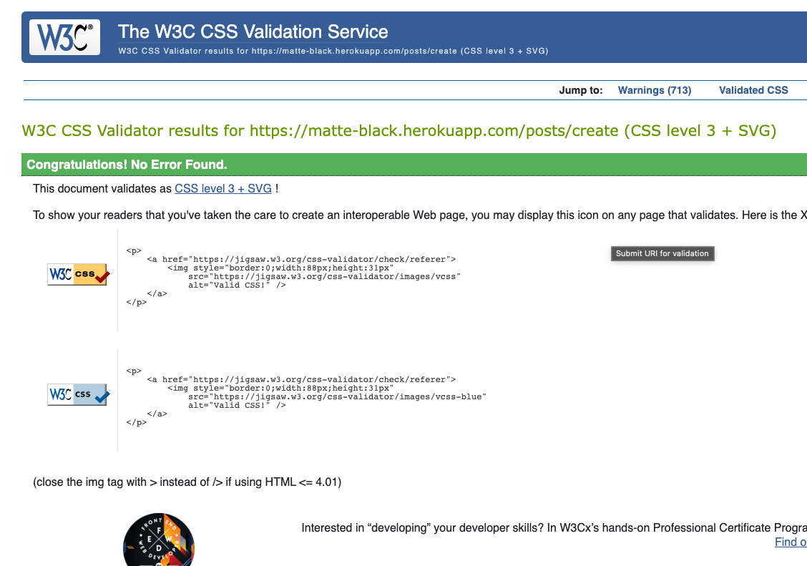
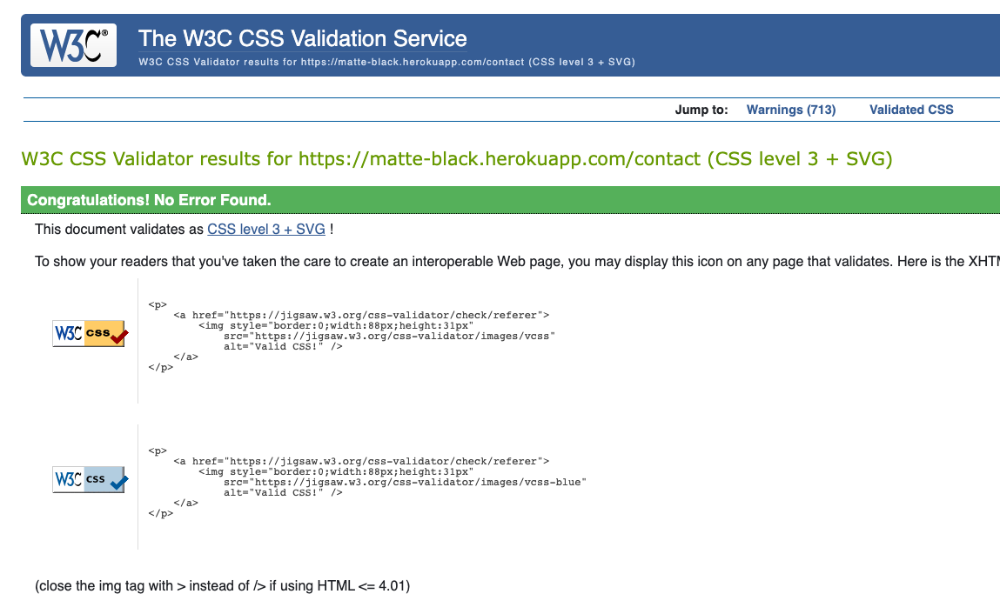
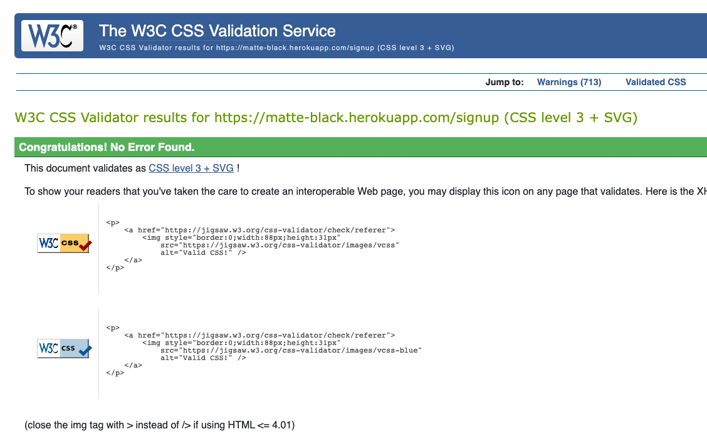

## ESLINT:

There were 5 errors in eslint which were unable to be validated by ESLINT: The error was: "PASS CHILDREN AS PROPS. INSTEAD, NEST CHILDREN BETWEEN THE OPENING AND CLOSING TAGS"
This error was also shown in the Walkthrough project Moments. After much research there was no fix. I belive the issue doesn't effect the way in whicht he project works and presents no real issue apart from react best practice. Hence I added ignore rules for the lines showing the errors:

The pages effected are: 
ProfilePage.js
PostsPage.js
Postpage.js
GalleryPostsPage.js
GalleryPostPage.js

These are ignored and the following line is added to each of these pages so the error isn't presented. 
/*eslint-disable*/

Here is an example of the error presented:
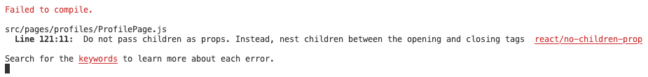

## SEO Testing
Below are screenshots taken from the chrome dev tools lighthouse function to evaluate SEO of the website. Looks like all looks fine apart from performance which I was unable to fix. However it will be added to future features to speed up site.
I used the following templates to text every part fo the site.

## Desktop

SEO Desktop Home testing result:

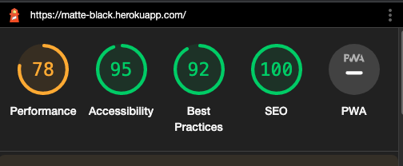

SEO Desktop Posts testing result:

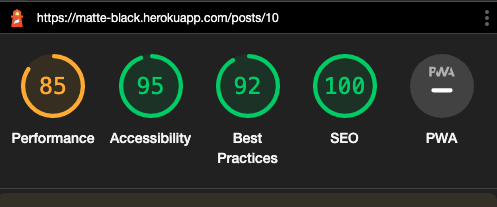

SEO Desktop Create Posts testing result:

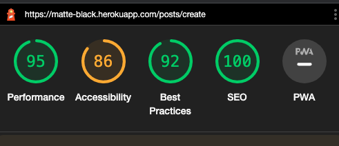

SEO Desktop Profiles testing result:

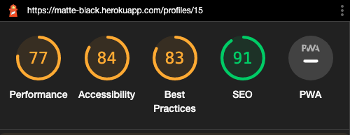

SEO Desktop Signup testing result:

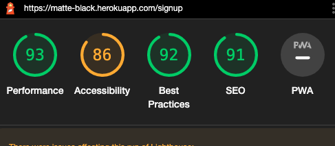

SEO Desktop Contact testing result:

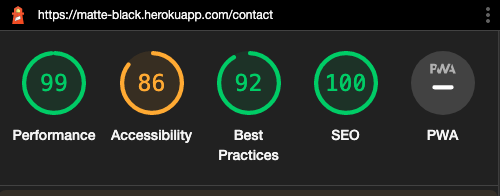

## Mobile

SEO Mobile Home testing result:

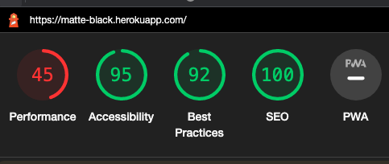

SEO Mobile Posts testing result:


SEO Mobile Create Posts testing result:


SEO Mobile Profiles testing result:


SEO Mobile Signup testing result:


SEO Mobile Contact testing result:


## Manual testing

Below are the user stories and the manual testing outcomes for each:
I did manual testing throughout my project according to my user stories to make sure all requirements were met. These were tracked via notion to make sure all was processed correctly. 

## As a user I can see posts even if I don't have an account

Conclusion - As seen below posts are shown on the home page when not signed in.


---

## As a user I can sign up so that I can have access to member features
## As a user I can sign in so that I can have access to member features

Conclusion - As seen below I could sign up and sign in successfully.


---

## As a user If I am signed in I can also sign out.

Conclusion - As seen below I could sign out successfully.


---

## As a user I can customise my profile.

Conclusion - As shown below you can add a tech bio and profile picture to customise profile.


---

## As a user I can view posts and gallery posts
## As a user I can create posts/gallery posts
## As a user I can edit my own posts/gallery posts
## As a user I can delete my own posts/gallery posts

Conclusion - As shown below you can Create, read, edit and delete posts or gallery posts.

## Posts

Add post:


View post:


Edit post: 


Delete post: 


## Gallery Posts

Add Gallerypost:


View Gallerypost:


Edit Gallerypost:


Delete Gallerypost:


There is a bug when you delete a gallery post it directs the site to the add gallery post form. But the gallery post does delete fine.


## As a user I can create comments on both posts and gallery posts
## As user I can view all comments
## As a user I can edit my own comments on both posts and gallery posts
## As a user I can delete my own comments on both posts and gallery posts

Conclusion - As shown below you can create, read, edit and delete comments on posts and gallery posts.

## Commenting on Posts


## Commenting on GalleryPosts


There is an existing bug when deleting comments where it doesn't show the deletion straight away, you need to refresh the page to see the reflected deleted comment.


---

## As a user I can be followed/unfollowed and I can follow/unfollow other users.

Conclusion - As shown below I can indeed follow and unfollow other users.


---

## As a user I can save posts which I can view in my saved section
## As a user I can unsave posts which removes a post in my saved section

Conclusion - As shown below I can indeed save and unsave posts.


---

## As a user I can see posts of followed users in my feed

Conclusion - As shown below followed user posts are indeed shown in my feed once I click follow on a user.


---

## As a user I can view other user profiles

Conclusion - As shown below I can visit other user profiles with no issues.


---

## As a user I can use the Navbar on any page for a smooth experience

Conclusion - As shown below a navbar is shown on all pages.


---

## As a user I can have access to the contact us form to contact Matte black hosts

Conclusion - Form is accessible and works apart from the fact that it doesn't actually send a email. The purpose of this was to be a placeholder for a future feature.


---

## As a user I can see who are the most followed users

Conclusion - As shown below the most followed profiles section shows on pages.


---

## As a user I can search posts with a specific criteria

Conclusion - As shown below I can search text from posts to only show filtered posts.


---

## As a user I am attracted to the look of the site and it’s easy to navigate

Conclusion - The navbar is easy to use, the pages are clean and look appealing. The colour scheme is warm and inviting.


---

# Bugs
## Fixed Bugs

1. 

## Unfixed Bugs

Due to time constrains we were unable to fix these following bugs:

1. Issue: When adding or editing  reviews the draft function looses the post as a end user.
Potential fix: Add a draft section in navbar where all drafts are saved.

2. Issue: In mobile mode when adding or editing reviews the summernote text field isn't responsive.
Potential fix: Would need more research. 

3. Issue: Downvotes button allignment is slightly higher then upvotes.
Potential fix: Would need more research.

4. Issue: No 404 error page
Potential fix: Add 404 error page and add to URL.py.

5. Issue: Back to top button displayed on all pages including signup, signin and sign out. 
Potential fix: Needs more research

# Deployment

## Deployment of Project:
Github:
1. Go to Code Insitite Template [CI template](https://github.com/Code-Institute-Org/gitpod-full-template)
2. Click use this template
3. Click Create new Repository
4. Name accordingly

Heroku/Elephant SQL
1. Login or Sign up to Heroku
2. Create new app
3. Name accordingly
4. Create Database in ElephantSQL:
    1. Sign up or Login
    2. Create new instance
    3. Give your plan a Name (this is commonly the name of the project), Select the Tiny Turtle (Free) plan, You can leave the Tags field blank
    4. Select region nearest to you
    5. Review and click create instance
    6. Open your new instance and grab your URL for use.
5. Create env.py in Django project with Database URL and setup a secret key. The code looks like this:
    import os
    os.environ["DATABASE_URL"]="<copiedURL>"
    os.environ["SECRET_KEY"]="my_super^secret@key"
6. Make sure it's added to your gitignore
7. Modify settings.py by adding:
    import os
    import dj_database_url
    if os.path.isfile('env.py'):
        import env
8. Lower down in settings.py add:
    SECRET_KEY = os.environ.get('SECRET_KEY')
9. Hook up your database by commenting account old database code and adding new:
    Comment out this:
     DATABASES = {
         'default': {
            'ENGINE': 'django.db.backends.sqlite3',
            'NAME': BASE_DIR / 'db.sqlite3',
        }
    }
    
    Add this:
    DATABASES = {
        'default': dj_database_url.parse(os.environ.get("DATABASE_URL"))
    }

10. Run python manage.py migrate
11. Push project to Github
12. In your Heroku go to your app
13. Go to settings
14. Config vars
15. Add your DATABASE_URL and SECRET_KEY and PORT as 8000.
16. Create Storage via Cloudinary:
    1. Create Cloudinary account
    2. Copy API Environment variable
    3. Add follwing to env.py:
        os.environ["CLOUDINARY_URL] = Add environment variable here
    4. Add same details into Heroku Config Vars to match.
    5. Add DISABLE_COLLECTSTATIC to 0 in Heroku Config Vars too.(removed at the end)
    6. Add following Cloudinary apps to  installed apps in settings.py:
            INSTALLED_APPS = [
                'django.contrib.admin',
                'django.contrib.auth',
                'django.contrib.contenttypes',
                'django.contrib.sessions',
                'django.contrib.messages',
                'django.contrib.sites',
                'cloudinary_storage',
                'django.contrib.staticfiles',
                'cloudinary',
            ]
    7. Towards the end of settings.py add:

        STATICFILES_STORAGE = 'cloudinary_storage.storage.'\
                      'StaticHashedCloudinaryStorage'
        STATICFILES_DIRS = [os.path.join(BASE_DIR, 'static')]
        STATIC_ROOT = os.path.join(BASE_DIR, 'staticfiles')

        MEDIA_URL = '/media/'
        DEFAULT_FILE_STORAGE = 'cloudinary_storage.storage.MediaCloudinaryStorage'

17. Add template files accordingly in settings.py:
            TEMPLATES_DIR = os.path.join(BASE_DIR, 'templates')
18. Under Templates in the settings.py file change 'DIRS' to reflect templates:
        'DIRS': [TEMPLATES_DIR],
19. Add Heroku Allowed hosts in settings.py:
        ALLOWED_HOSTS = ['unfiltered-anime.herokuapp.com', 'localhost']
20. create media, static and templates folders in root of project. 
21. Create Procfie with:
        web: gunicorn unfiltered_anime.wsgi
22. Deploy to Github.
23. Back into Heroku go back into your app and click deploy then for deployment method link to your Github.
24. Search for repo name and connect
25. Deploy branch and enable automatic deployment.

Once your finish your project make sure you do the following:
Remove DISABLE_COLLECTSTATIC from Heroku VARS.
In your settings.py turn off debugging. 

# References
1. Template Used as respository: [CI template](https://github.com/Code-Institute-Org/gitpod-full-template)
2. Fonts used were from Google Fonts: [Google Fonts](https://fonts.google.com/)
3. Icons were taken from Font Awesone: [Font Awesome](https://fontawesome.com/)
4. Inspiration for structures, models, views and URLS were taken from the "I think therefore I Blog" project walkthrough: [I think there I blog Walkthrogh](https://github.com/Code-Institute-Solutions/Django3blog/tree/master/11_messages)
5. Much of Project help was taken from Django Central such as issues linking URL, Models and views: [Django Central Articles](https://djangocentral.com/articles/)
6. For General help through out my project teh offical Django documentation was great help: [Django](https://docs.djangoproject.com/)
7. Bootstrap was used for design and structure of UI: [Bootstrap](https://getbootstrap.com/)
8. Button design was fro I used "Buy me a coffee": [Copy & Paste CSS] (https://copy-paste-css.com/)
9. Placeholder images are taken from: [Pixabay](https://pixabay.com/)
10. Deployment was on Heroku: [Heroku](https://heroku.com/)
11. Static media storage: [Cloudinary](https://cloudinary.com/)
12. Database: [ElephantSQL](https://elephantsql.com)
13. HTML template used for Blog: [Clean Blog](https://startbootstrap.com/theme/clean-blog)
14. Extended text fields for Bootstrap: [Summernote](https://summernote.org/)
15. Django Authentication source: [Django-allauth](https://django-allauth.readthedocs.io/en/latest/)
16. Django general help: [Mozilla Developers](https://developer.mozilla.org/)
17. Wireframe: [Balsamiq](https://balsamiq.com/)
18. Models diagram: [LucidChart](https://www.lucidchart.com/)
19. Favicon Generator: [Favicon Generator](https://favicon.io/favicon-converter/)
20. General help taken for HTML, CSS, JS, Python and django: [W3schools](https://www.w3schools.com/)
21. General project help was also taken from Reddit: [Reddit](https://www.reddit.com/)
22. General project help was also taken from Stackoverflow: [StackOverflow](https://stackoverflow.com/)
23. Help with watch list article: [Article for Watchlist 1](https://stackoverflow.com/questions/63403309/watchlist-system-on-django) , [Article for Watchlist 2](https://forum.djangoproject.com/t/adding-watchlist-watchlist-not-displaying-added-items/12411)
24. Top of page button: [Top of page button](https://www.w3schools.com/howto/howto_js_scroll_to_top.asp)

# Acknowledgements
1. Much help was taken from Tutors at Code Institute.
2. Much help and inspirtation was taken from Code Insitute course materials.
3. Much help was taken from Code Institute Slack channels. 